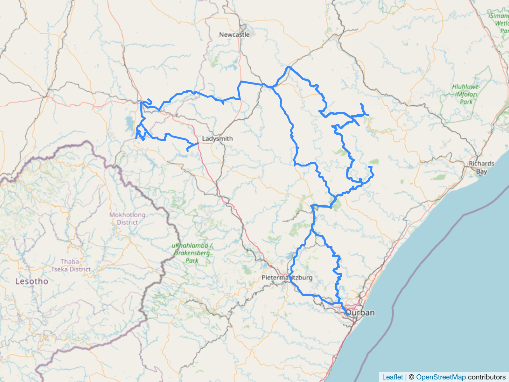

# leaflet_render

Render geojson using headless Chromium and leaflet.

## Output



## Usage:

```
from leaflet_render import render_geojson

geojson_string = """
{
    "type": "Feature",
    "geometry": {
        "type": "Point",
        "coordinates": [-104.99404, 39.75621]
    }
}
"""

rendered_bytes = render_geojson(geojson_string, width=600, height=600)

with open('render.png', 'wb') as f:
    f.write(rendered_bytes)

```

The render_geojson functions returns the bytes of a PNG image. Note to pass a string and
not dict as input.

## Configuration

Set the `CHROMIUM_PATH` environment variable or pass `chromium_path` as keyword argument.

## Notes

A new instance of Chromium is spawned on each function call. Optimizations to batch
render efficiently can be investigated in future.

A useful tool to translate between various GIS formats is [GPS Babel](https://www.gpsbabel.org/).

## Development

To update leaflet sources, edit sources.txt then:

```
cd leaflet_render
wget -i ../sources.txt 
```
